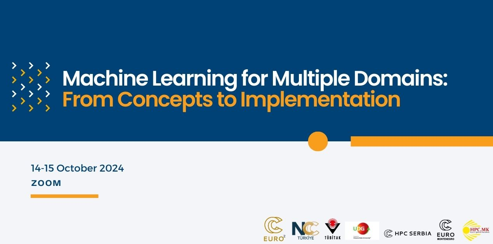

## Table of Contents
1. [Description](#description)
2. [Information](#information)
4. [Certificate](#certificate)

## Description

The training will begin with an overview of the EuroCC project and NCCs. Following that, colleagues from NCC Turkey will introduce the Turkish National e-Science e-Infrastructure (TRUBA), which will be utilized during the hands-on sessions. HPC experts will assist participants in accessing the TRUBA HPC infrastructure. Following these introductory sessions, colleagues from NCC North Macedonia will discuss MLOps (Machine Learning Operations) concepts, the different phases in MLOps processes, and identify various levels of MLOps maturity. The first day of the training will conclude with a session covering protein language models and how to use them in protein sequence prediction tasks, presented by NCC Turkey.

On the second day of the training, we will start with a session covering the basic properties of social networks and how to efficiently analyze large social networks using HPC infrastructure. Dr. Marija Mitrović Dankulov from HPC Serbia will begin by introducing the modeling of large-scale social data. In the hands-on session, she will practically illustrate the implementation of the model. Following this, colleagues from NCC Montenegro will demonstrate the use of Python for Natural Language Processing in the analysis of real-time social media data. This analysis will help identify trends and sentiments, providing valuable insights for business decisions.

This training consisting of consists of lectures, demos, and hands-on sessions, was jointly organized by NCC Turkey, NCC Montenegro, NCC North Macedonia, and HPC Serbia from the 14th to 15th October 2024.

## Information

The overall goals of this course were the following:
> - Design, develop, deploy and iterate on production-grade ML applications.
> - Protein language models and using them for downstream prediction task.
> - Modeling of large-scale social data.
> - Analyzing social media trends.

More detailed information and links for the course can be found on the [course website](https://indico.truba.gov.tr/event/182/).

## Certificate

The certificate for the workshop can be found below:

["Machine Learning for Multiple Domains: From Concepts to Implementation" - NCC Turkey, NCC Montenegro, NCC North Macedonia, and HPC Serbia]() (Issued On: October 2024)
